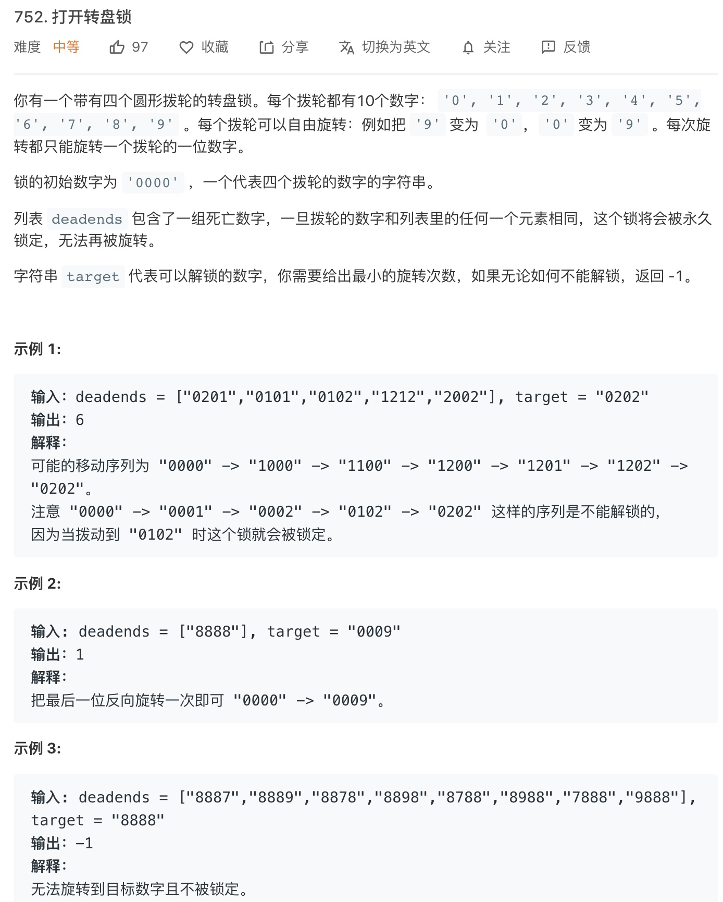

# BFS  

## 基本概念  

一般来说在找最短路径的时候使用 BFS，其他时候还是 DFS 使用得多一些（主要是递归代码好写）。


## Template

```
// 计算从起点 start 到终点 target 的最近距离
int BFS(Node start, Node target) {
    Queue<Node> q; // 核心数据结构
    Set<Node> visited; // 避免走回头路

    q.offer(start); // 将起点加入队列
    visited.add(start);
    int step = 0; // 记录扩散的步数

    while (q not empty) {
        int sz = q.size();
        /* 将当前队列中的所有节点向四周扩散 */
        for (int i = 0; i < sz; i++) {
            Node cur = q.poll();
            /* 划重点：这里判断是否到达终点 */
            if (cur is target)
                return step;
            /* 将 cur 的相邻节点加入队列 */
            for (Node x : cur.adj())
                if (x not in visited) {
                    q.offer(x);
                    visited.add(x);
                }
        }
        /* 划重点：更新步数在这里 */
        step++;
    }
}

说明：
cur.adj() 泛指 cur 相邻的节点，比如说二维数组中，cur 上下左右四面的位置就是相邻节点；
visited 的主要作用是防止走回头路，大部分时候都是必须的，但是像一般的二叉树结构，没有子节点到父节点的指针，不会走回头路就不需要 visited。
```

## 示例  
### 示例1：leetcode 111 二叉树的最小高度

套用模板写写：
  
```
int minDepth(TreeNode root) {
    if (null == root) {
        return 0;     
    }

    Queue<TreeNode> queue = new LinkedList<>();
    queue.offer(root);
    int depth = 1;

    while(!queue.isEmpty()) {
        int size = queue.size();
        for(int i = 0; i < size; i++) {
            TreeNode cur = queue.poll();
            if (null == cur.left && null == cur.right) {
                return depth;
            }
            if (null != cur.left) {
                queue.offer(cur.left);
            }
            if (null != cur.right) {
                queue.offer(cur.right);
            }      
        }
    
        depth += 1;
    }

    return depth;
}
```

## 示例2：leetcode 752 解开密码锁的最少次数


题解

```

```